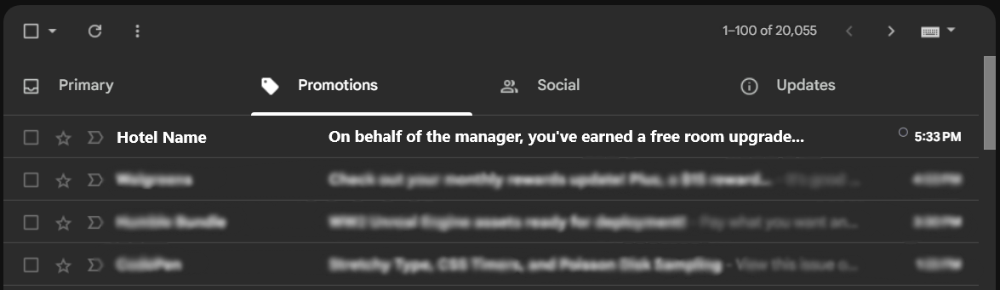
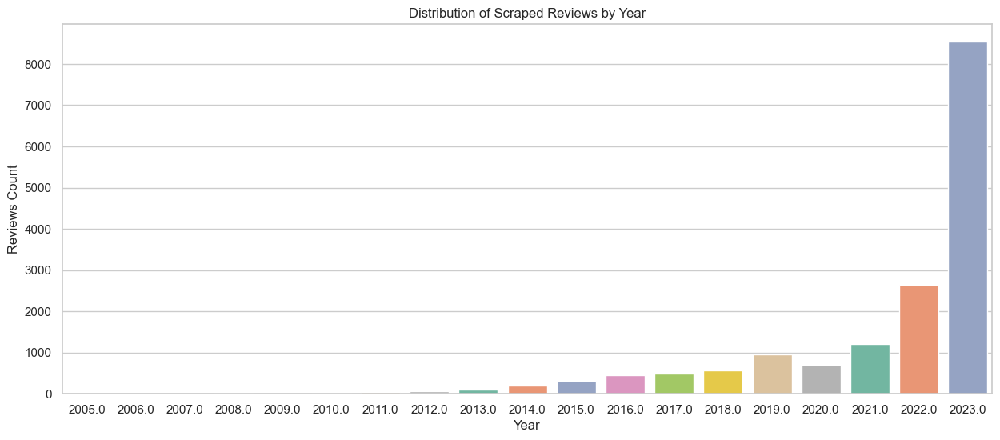
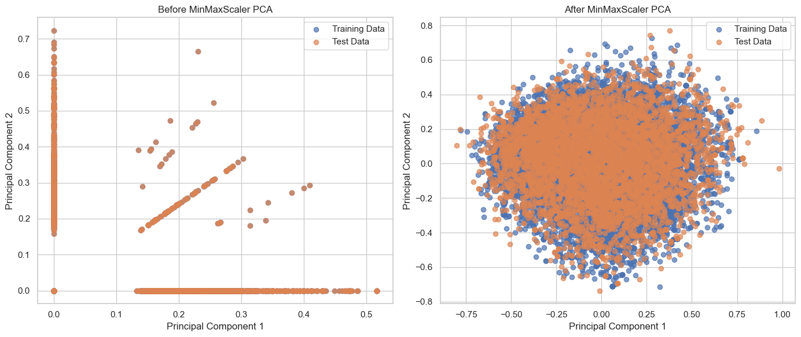
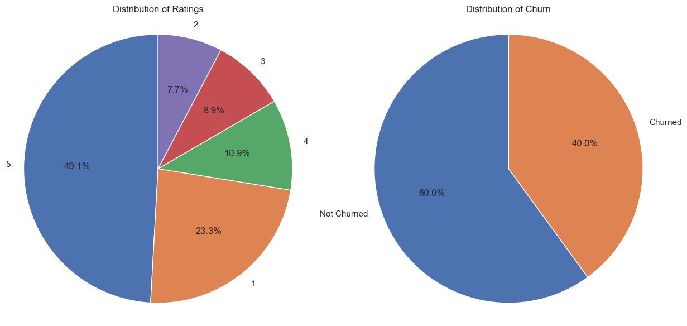
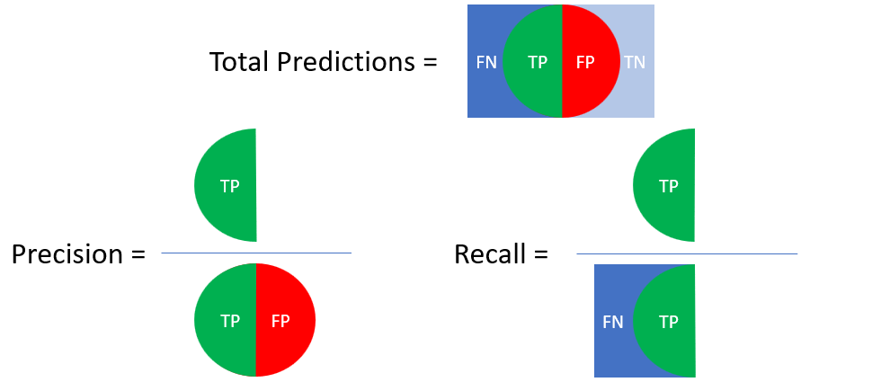
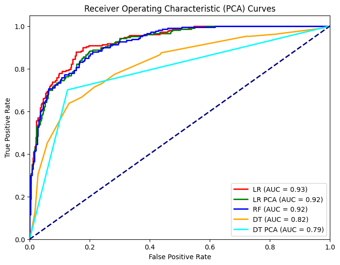

Badge [source](https://shields.io/)

## Business Problem
- To tackle the advent of negative reviews, hotel businesses need to consider recovery tactics such as additional staff training, more amenities, and incentivized e-commerce like the email above. 
- Increasing customer retention and optimizing marketing resource allocation are critical challenges for the hospitality industry.
- I aim to develop a predictive model that identifies customers at a high risk of churning from hotel services.
- Since hotels can sustain significant costs in incentivized marketing for churn customers, my primary focus is on minimizing the number of customers wrongly identifies as churn. By achieving a high rate of predicting customers who will actually churn, we can ensure that our marketing efforts are targeted towards the proper audience, and therefore maximizing our customer retention rates and reducing unnecessary marketing expenses.

# Key findings: As of development on 9/1/2023, Random Forest was able to achieve the best in correctly predicting a customer will either churn or not churn (accuracy) and correctly predicting a customer will churn (precision).

## Data Source

- Our scope of reference is the **_first page of reviews_** scraped from the **_first 10 pages of hotels_** within Austin, TX on August 2023, sorted by Best Value. All first pages of reviews has a maximum of 10 reviews, but not all hotels in the scraped data will have all 10. It can be assumed that lesser Best Value hotels has a lesser chance of being reviewed.
- 2013 unique reviews were scraped.
- 294 unique hotel names were scraped.
- Customers are more likely to put trust in a hotel based on its recent reviews. 59% of my scraped reviews are from 2023, despite having a time range from December 2017 to August 2023.
  

## Data Validation & Cleaning
- **_Duplicate Removal:_** Removing duplicate reviews is a must to avoid introducing bias to our models. Since the rows of reviews (independent variable) are our only interest, duplicates were checked and none were found.
- **_Missing Data:_** Among all columns, missing values was only found in the "date_stayed" column, but since this variable was only used for visualizations and not in our models, it was left as is.
- **_Text Cleaning:_** The reviews that are stored in my local database, which embody both the title and the "Read More" section of the reviews, are extracted from the "span" HTML tag and processed by the following steps:
  - Convert to lowercase.
  - Tokenize by isolating one or more word characters appeared in a row (alphanumberic characters plus underscore "_").
  - Remove English stop words from "stop_words" (174 stop words) and "nltk" (179 stop words) Python libraries.
  - Remove punctuations.

## Preprocessing
- **_Text Processing:_** The following steps are necessary for building a quality vocabulary from the cleaned corpus, or collection of texts, before converting it into numerical features that are most suitable for machine learning algorithms.
  - Tokenize by isolating one or more uppercase and lowercase letters appeared in a row (AAAHH).
  - Tokenize by isolating one or more lowercase letters immediately following an apostrophe "'" appeared in a row (I'mm).
  - Assign part-of-speech tags from "nltk" to the processed words so far, based on both their definitions and their contexts.
  - Exclusively includes nouns, adjectives, verbs, and adverbs from WordNet with a custom function. "Early [research papers] (1) has focused on using adjectives such as ‘good’ and ‘bad’ and adverbs like ‘terrifically’ and ‘hatefully’ as the important indicators of sentiment (2). Intuitively, this is what we would expect of an opinionated document. However, later [research papers] (3) also suggests that other parts of speech such as verbs and even nouns (4) could be valuable indicators of sentiment."
  - Lemmatize by replacing words with their root form (caring -> care, feet -> foot, striped -> strip) to reduce dimensionality and maintain consistency. The latter example is one problem that is yet to be taken care of.
  - IDEA: Build app that showcases the cleaned and processed reviews live in action prior for modeling.
- **_Train/test Split:_** 70% of the reviews (independent variable) and our target churn/non-churn (dependent variable) is used to train our models, where 30% is used to validate/test them. This ratio is a common practice in data science.
- **_Vectorization:_** TfidfVectorizer() is used to omit words that both appear in more than 10% and less than 5% of the cleaned and processed reviews, before converting then into numerical features which embody a matrix of TF-IDF features (Term Frequency-Inverse Document Frequency). As said earlier, this format is most suitable for machine learning algorithms.
- **_MinMaxScaler:_**
  - Vectorized reviews are scaled from 0 to 1 via **MinMaxScaler()** prior to dimensionality reduction via **PCA()**.
  - Zero-to-one scaling is a must for PCA.
  - Not all models will utilize PCA.
- **_Principle Component Analysis (PCA):_**
  - PCA is used to reduce the number of TF-IDF features extracted from the reviews (dimensionality reduction), while getting rid of collinear features which will end up in a single PCA component.
- The effects of MinMaxScaler() and PCA() can be seen below.
  
- Here's how scaling and PCA can benefit the comparison models:
  - **_Convergence:_** Logistic regression can converge faster and more reliably when our numerical features are on similar scales. Scaling helps prevent one feature from dominating the updates during training.
  - **_Regularization:_** Regularization techniques like L1 or L2, or rather the penalty parameter in sklearn's LogisticRegression() for example, can help ensure that regularization affects all features more uniformly. This can lead to better feature selection and prevent overemphasis on dominant features.
  - **_Non-linearity:_** Scaling helps logistic regression perform better since the relationships between our features and the target variable are not linear.
- The vectorized and features-reduced reviews will now be referred as the processed reviews.

## The Comparison Models
- **_Logistic Regression_**
  - **_Feature Importance:_** Provides straightforward interpretation, namely importance features stating which aspects of hotel reviews influence the likelihood of customer churn.
  - **_Commonly Used Model:_** It is a simple yet effective approach to modeling binary response variables (in this case churn vs non-churn) and can serve as a solid baseline model to compare against our other models.
  - **_Hyperparameter Tuning:_**  Tuning with cross-validation was kept simple with 5-fold cross-validation and grid search with class_weight='balanced', C from 0.0 to 1.0, max_iter=100, and penalty between 'none' and 'l2'.
  - **_Validation:_** TODO
  - **_Underlying Math:_** TODO
- **_Random Forest_**
  - **_Nonlinear Relationships:_** Can also provide features importance as well as capture nonlinear relationships between features effectively. In the context of hotel reviews, this model type can better handle the complex relationships of sentimental values within the reviews.
  - **_PCA Warning:_** Model was not trained with the processed reviews, since it does not perform well when features are monotonic transformations of other features, making the forest trees less independent from each other.
  - **_Hyperparameter Tuning:_** Tuning with cross-validation was first done with 5-fold cross-validation and grid search with max_features and n_estimators, then criterion and max_depth, then min_sample_leaf and min_sample_split, and finally class_weight.
  - **_Validation:_** TODO
  - **_Underlying Math:_** TODO
- **_Decision Tree_**
  - **_Customer Segmentation:_** Can also provide features importance as well as naturally divide the data into segments based on feature values, which is useful for identifying specific groups of customers who are more likly to churn based on their reviews.
  - **_Highly Interpretable:_** The dividing process can be visualized to be showcased to a non-technical audience.
  - **_Hyperparameter Tuning:_** Tuning with cross-validation was first done with 5-fold cross-validation and grid search with max_features and max_leaf_nodes, then criterion and max_depth, then min_sample_leaf and min_sample_split, and finally class_weight.
  - **_Validation:_** TODO
  - **_Underlying Math:_** TODO

## Distribution of Ratings & Target Labeling
  - **_Class Imbalance_:** Imbalance in the ratings distribution can negatively impact the accuracy of the models. Converting the target variable to a binary variable, in this case churn or non-churn, will help alleviate this class imbalance.
    
  - **_Non-churn:_** To aid this decision for target labeling, it can be assumed that there is strong evidence in reviews starred 4 and 5 that the customer in question will most likely book a room again or recommend it to friends or family, while giving constructive criticism for some minor negative experience. These customers will be put in the non-churn category.
  - **_Churn:_** Likewise, there is strong evidence in reviews starred 3, 2 and 1 that the customer in question will either state that the hotel is average compared to others, gave largely negative comments to a majority of their experience, and frankly denies to recommend the hotel to anyone based on their entire experience. These customers will be put in the churn category.

## Class Weight
- As mentioned earlier, by achieving a high rate of predicting customers who will actually churn, or True Positives (TP), we can ensure that our marketing efforts are targeted towards the proper audience. However, since we can also sustain significant costs in incentivized marketing for churn customers, my primary focus is on minimizing the number of customers wrongly identifies as churn, or False Positives (FP). Naturally, this aligns with the need to strive for a higher precision.
- And to reiterate from the distribution of churn, the majority of reviews are "non-churn", whereas the minority of reviews is "churn".
- Tuning with the hyperparameter "class_weight", which is available in all our compared models, can prevent them from being biased toward the majority class, or in other words, the models by default will have more chances at predicting for "non-churn". Therefore, by assigning more weight to the minority class, we are essentially giving the models more chance at predicting for "churn" instead, or in other words, the ability to increase the production of both TP and FP (for the below image, imagine the red and green half-circles increase at the same time).
  
- However, our goal is to not produce more false positives, but rather minimize them. Therefore, the number of positives produced by our models can be kept at default, where any additional weight assigned to either "churn" or "non-churn" is unnecessary.
- We can still attempt to tune the hyperparameter "class_weight" to see if the algorithms retrieved from Python will correctly not assign weight to either classes and choose "balanced", which is the said intended purpose.
- Fortunately, we can force the ability to minimize FP by applying a technique post-modeling called threshold selection.
- **_Side Note:_** In cases like medical diagnosis or fraud detection, False Negatives (FN) can have serious consequences (saying that a patient does not have cancer while he/she actually does is very detrimental, saying that a transaction is not fraud while it actually is, is very detrimental). By giving the models the ability to produce more TP even if it results in more FP, FN will automatically decrease. Therefore, in cases with possibly 3 or more classes, techniques like resampling or SMOTE must be considered, in addition to assigning more weight to a certain class by tuning the compared models with "class_weight".

## Results
| Model    | Accuracy | Precision | Recall |
| :-------- | -------: | --------: | -------: |
| Logistic Regression       | 86% | 81% | 79% |
| Logistic Regression (PCA) | 84% | 78% | 75% |
| Decision Tree             | 78% | 70% | 65% |
| Decision Tree (PCA)       | 81% | 74% | 70% |
| Random Forest             | 86% | 85% | 71% |

## Final Verdict
- As of development on 9/1/2023, Random Forest was able to achieve the best in both evaluation metrics accuracy and precision, where the other compared models could not.
- Despite having the same best accuracy and highest Area Under the Curve (AUC), Logistic Regression would be innapropriate since it produced a lower precision rate.
- **_Side Note:_** All models except Decision Tree (PCA) chose "class_weight" to be 1:1. This model chose to assign twice as much weight to "non-churn" instead (1:2 churn:non-churn), where it can be assumed that when training Decision Tree with post-PCA features, the majority class "non-churn" needed twice as much representation within the data.

## Limitations & Future Improvements
- **_Validation Tests:_**
  - PCA is known to perform worse for datasets with more features than samples. The number of features created by preprocessing is far too greater than the number of review samples scraped, which is only around 2000.
  - Between "Logistic Regression" and "Logistic Regression (PCA)", with the ability to scrape a much larger number of recent reviews, we should see better performance for the latter.
  - Random Forest also typically loses performance when there are more features than samples, therefore the ability to scrape more reviews is needed.
  - However, Decision Tree is also prone to overfitting with addition of more data.
- **_Modeling:_** Models compared can be extended to K-Neared Neighbors (KNN), Support Vector Machines (SVM), and Naive Bayes, all of which can be implemented as binary classifiers.
- **_Feature Engineering:_** Features can be extended to include the review length, calculated sentiment scores from each review, and one-hot coded topics extracted from each review.

## TODO
- Compared models validation and underlying math.
- Threshold selection on best model (Random Forest).
- Shap Values (with important features table).
- Predicting A New Review (ft. Chat-GPT).
- Scale the scraped reviews to the next pages of hotels after the first 10, since it is feasible, then repeat the first 4 steps of this list.
- Ability to simulate text preprocessing and churn prediction from user input in live action using front-end (Flask App OR Node.js, React, either MySQL or PostgreSQL for simplicity or scalability).
  - Deploy app via AWS or Google Cloud.
- K-Neared Neighbors (KNN), Support Vector Machines (SVM), and Naive Bayes.
- Incorporate review length, calculated sentiment scores from each review, and one-hot coded topics extracted from each review.
  
## References
- (1) https://dl.acm.org/doi/10.3115/976909.979640
- (2) https://www.sciencedirect.com/science/article/pii/S0167923612001340#bb0070
- (3) https://dl.acm.org/doi/10.1145/1099554.1099714
- (4) https://dl.acm.org/doi/10.3115/1119176.1119180
