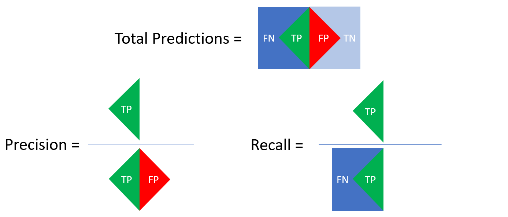

Badge [source](https://shields.io/)

# Key findings: UNDER CONSTRUCTION

## Author
- [@duynlq](https://github.com/duynlq)

## Business Problem

Increasing customer retention and optimizing marketing resource allocation are critical challenges for the hospitality industry. I aim to develop an optimal predictive model that identifies customers at a high risk of churning from our services. Since we can sustain significant costs in incentivized marketing for churn customers, my primary focus is on minimizing the number of customers wrongly identifies as churn. By achieving a high rate of predicting customers who will actually churn, we can ensure that our marketing efforts are targeted towards the proper audience, and therefore maximizing our customer retention rates and reducing unnecessary marketing expenses.

## Data Source

- Our scope of reference is the **_first page of reviews_** scraped from the **_first 10 pages of hotels_** within Austin, TX on August 2023, sorted by Best Value. All first pages of reviews has a maximum of 10 reviews, but not all hotels in the scraped data will have all 10. It can be assumed that lesser Best Value hotels has a lesser chance of being reviewed.
- 2013 unique reviews were scraped.
- 294 unique hotel names were scraped.

## Quick EDA

- Customers are more likely to put trust in a hotel based on its recent reviews. 59% of my scraped reviews are from 2023, despite having a time range from December 2017 to August 2023.

- Class imbalance in the ratings distribution can negatively impact the accuracy of my models. Converting the target variable to a binary variable, in this case churn or non-churn, will serve the models better.
- It also can be assumed that there is strong evidence in reviews starred 4 and 5 that the customer in question will most likely book a room again or recommend it to friends or family, while giving constructive criticism for some minor negative experience. These customers will be put in the non-churn category.
- Likewise, there is strong evidence in reviews starred 3, 2 and 1 that the customer in question will either state that the hotel is average compared to others, gave largely negative comments to a majority of their experience, and frankly denies to recommend the hotel to anyone based on their entire experience. These customers will be put in the churn category.

## Preprocessing
- **_Train/test Split_** 70/30 was used on both the rows of reviews, and rows of churn/non-churn. This ratio is a fairly common practice.
- **_Building Vocabulary_** To aid the predictive ability of my model, the vocabulary of words extracted from the reviews will include nouns, adjectives, verbs, and adverbs. "Early [research papers] (1) has focused on using adjectives such as ‘good’ and ‘bad’ and adverbs like ‘terrifically’ and ‘hatefully’ as the important indicators of sentiment (2). Intuitively, this is what we would expect of an opinionated document. However, later [research papers] (3) also suggests that other parts of speech such as verbs and even nouns (4) could be valuable indicators of sentiment."
- **_Premodeling_** TfidfVectorizer() is used to omit terms that both appear in more than 10% and less than 5% of the vectorized documents of reviews. Vectorized reviews are then scaled from 0 to 1 via MinMaxScaler() prior to dimensionality reduction via PCA(); 0 to 1 scaling is a must for PCA.
  
## Results
| Model    | Accuracy | Precision (Churn) | Recall (Churn) |
| -------- | ------- | -------- | ------- |
| Logistic Regression       | 84% | 72% | 87% |
| Logistic Regression (PCA) | 83% | 71% | 86% |
| Random Forest             | 86% | 85% | 71% |
| Decision Tree             | 78% | 70% | 65% |
| Decision Tree (PCA)       | 81% | 74% | 70% |
### Precision vs Recall

- As mentioned earlier, by achieving a high rate of predicting customers who will actually churn, or True Positives (TP), we can ensure that our marketing efforts are targeted towards the proper audience. Since we can sustain significant costs in incentivized marketing for churn customers, my primary focus is on minimizing the number of customers wrongly identifies as churn, or False Positives (FP).
- Naturally, our goal stated above aligns with the need to strive for a high precision.

## Modeling Thought Process
- **_Why these models?_**
  - **_Random Forest_** was not trained with the vectorized and features-reduced reviews, since the model does not perform well when features are monotonic transformations of other features, making the forest trees less independent from each other. Random Forest typically loses performance when there are more features than samples, but that doesn't apply here.
  - **_Final Verdict_** [THIS MODEL] was able to achieve [satifactory results] where the other compared models could not.

## Lessons learned and recommendations

## Limitations & Future Improvements
- PCA is known to perform worse for datasets with more features than samples. The number of "features" created by preprocessing is far too greater than the number of review samples scraped, which is only around 2000. With the ability to scrape a much larger number of recent reviews, we will see a bigger gap between the PCA and non-PCA in terms of performance.

## Repository Structure

## Methods
- Natual Language Processing (NLP): Tokenizing, Lemmatizing, Vectorizing, Principal Component Analysis (PCA)
- Supervised Machine Learning: Logistic Regression, Random Forest
- A/B Testing

## References
- (1) https://dl.acm.org/doi/10.3115/976909.979640
- (2) https://www.sciencedirect.com/science/article/pii/S0167923612001340#bb0070
- (3) https://dl.acm.org/doi/10.1145/1099554.1099714
- (4) https://dl.acm.org/doi/10.3115/1119176.1119180
